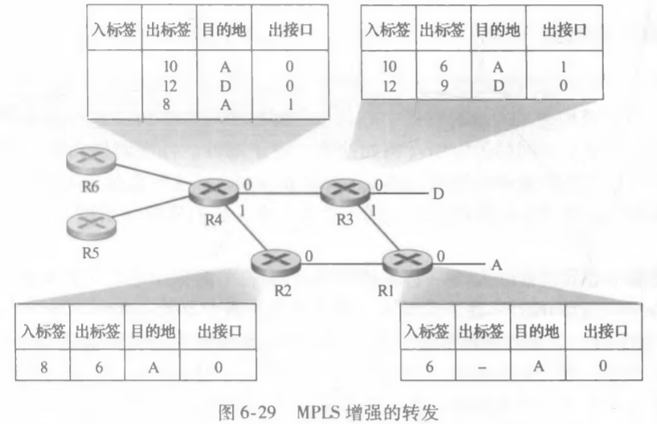
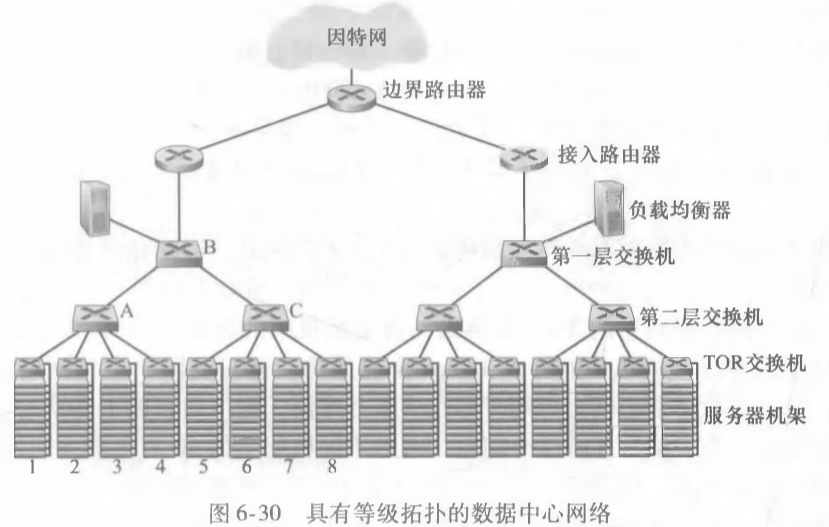
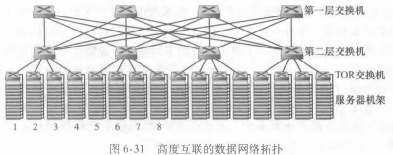

# 作业12

## 1. P27

### 题目

在这个习题中，我们探讨用于IP语音应用的小分组。小分组长度的一个主要缺点是链路带宽的较 大比例被首部字节所消耗。基于此，假定分组是由P字节和5字节首部组成。 

a. 考虑直接发送一个数字编码语音源。假定该源以128kbps的恒定速率进行编码。假设每个源向网络发送分组之前每个分组被完全填充。填充一个分组所需的时间是**分组化时延**（packetizationdelay）。根据 L ，确定分组化时延（以毫秒计）。

b. 大于20毫秒的分组化时延会导致一个明显的、令人不快的回音。对于L = 1500字节（大致对应于一个最大长度的以太网分组）和 L = 50字节（对应于一个ATM信元），确定该分组化时延。 

c. 对R = 622Mbps的链路速率以及L = 1500字节和 L =50字节，计算单台交换机的存储转发时延。

d. 对使用小分组长度的优点进行评述。 

### 回答

**a**. 分组化时延计算方式如下：

packetization delay = (L * 8) / 128kbps = L/16 ms

**b**. 根据 a 中的公式，分别对 L = 1500, 50 计算出时延如下：

L = 1500 时，packetization delay = 1500/16 = 93.75 ms

L = 50 时，packetization delay = 50/16 = 3.125 ms

**c**. 存储转发时延的计算方式为：(L*8 + 40) / R，R = 622 Mbps

当 L = 1500 时，存储转发时延 = (1500 * 8 + 40) / 622Mbps = 19.36 μs

当 L = 50 时，存储转发时延 = (50 * 8 + 40) / 622Mbps = 0.7 μs

**d**. 根据以上的计算结果可以看出，小分组长度在进行分组化时，所需要的时延较低，能够很好地满足小于20ms的需求。而大分组长度则会产生很大的分组化时延，无法满足小于20ms的需求。

---------------------

## 2. P30

### 题目

再次考虑上一个习题中相同的场景，但假定从R6发往D的分组经R6-R4-R3交换，而从R5发往D，的分组经R4-R2-R1-R3交换。说明为使这些成为可能在所有路由器中的MPLS表。 

### 回答

R6:

| 入标签 | 出标签 | 目的地 | 出接口 |
| :----: | :----: | :----: | :----: |
|        |   7    |   A    |   0    |
|        |   5    |   D    |   0    |

R5:

| 入标签 | 出标签 | 目的地 | 出接口 |
| :----: | :----: | :----: | :----: |
|        |   4    |   A    |   0    |
|        |   3    |   D    |   0    |

R4:

| 入标签 | 出标签 | 目的地 | 出接口 |
| :----: | :----: | :----: | :----: |
|   7    |   10   |   A    |   0    |
|   5    |   12   |   D    |   0    |
|   4    |   8    |   A    |   1    |
|   3    |   2    |   D    |   1    |

R3 不变

R2 :

| 入标签 | 出标签 | 目的地 | 出接口 |
| :----: | :----: | :----: | :----: |
|   8    |   6    |   A    |   0    |
|   2    |   1    |   D    |   0    |

R1:

| 入标签 | 出标签 | 目的地 | 出接口 |
| :----: | :----: | :----: | :----: |
|   6    |   -    |   A    |   0    |
|   1    |   12   |   D    |   1    |

--------------------------------------

## 3. P32

### 题目

考虑在图6-30中具有等级拓扑的数据中心网络。假设现在有80对流，在第1和第9机架之间有10 个流，在第2和第10机架之间有10个流，等等。进一步假设网络中的所有链路是10Gbps，而主机和TOR交换机之间的链路是1Gbps。 

a.每条流具有相同的数据率；确定一条流的最大速率。

b. 对于相同的流量模式，对于图6-31中高度互联的拓扑，确定一条流的最大速率。

c. 现在假设有类似的流量模式，但在每个机架上涉及20台主机和160对流。确定对这两个拓扑的最大流速率。 

### 回答

**a**. 在图 6-30 中，主要的瓶颈在于交换机 B 到边界路由器之间的链路。该链路数据传输速率为 10 Gbps，而一共有 8 个机架的共 80 对流共享该链路，每条流具有相同的数据率，故：

一条流最大速率为：10Gbps / 80 = 0.125 Gbps.

**b**. 在图 6-31 中，每4个机架到另外4个机架的之间有4条路径（接收方的第二层交换机有四个接入链路），故可以有 40Gbps 的传输速率，一共由4个机架的 40 对流共享，故：

一条流最大速率为：40Gbps / 40 = 1 Gbps.

**c**. 由于总的流数变为了 160 对，故根据之前的分析，有：

一条流最大速率为：40Gbps / 80 = 0.5 Gbps.

